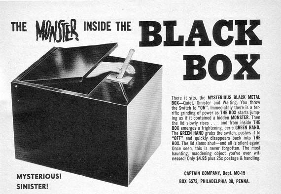
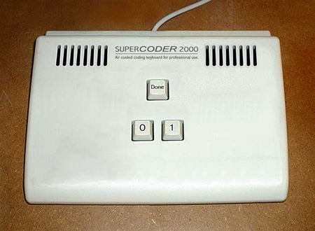
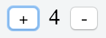
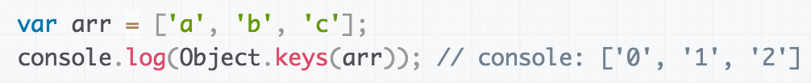

<!-- background: "./assets/next-level-testing.svg" -->

Note:
Hi, my name is Sune, I'm a software engineer at Zendesk here in
Copenhagen.

Note:
I been working professionally as a developer for almost 10 years. If I had
to make an educated estimate on how much of my time was spend debugging,
fixing bugs and reworking broken stuff during those years, I would say
that it is well above 50 procent. That quite frankly makes me a little
mad, it is just an enormous waste of time.

Note:
I think that a lot of that wasted time could have been avoided by writing more
and better tests.

===

## Make testing suck less

Note:
But I have a feeling that a lot of people don't really like writing tests.
They don't see tests as a tool that will help them improving their performance.
So they only write tests out of necessity.

Note: I don't blame them, there are a lot of reasons why writing tests can be
tedious work.

Note: So here is some advice on how to make testing suck less.


---

### Write your tests upfront

Note: the first thing I'll recommend is to write your tests upfront.

Note: it is much harder to test existing code than it is to write the tests
while you are implementing your production code.

Note: I know that it takes a lot of discipline, but every time I manage to do it
myself, I'm rewarded for my effort.

Note: You may feel the you can go faster without any tests or by implementing
them later, but trust me, that won't hold up in the long run. It is much better
to move a bit slower but always moving forward, instead of having to go back and
fix stuff all the time.


---

### Make your tests fast

Note: another thing that is really important, is to have a fast feedback
loop.

Note: nobody likes waiting unless they are out of coffee.

* Isolate your tests from IO as much as possible.
* Only run the tests your are working on.

---

### Stop testing internals



Note: people often complain that small changes breaks a lot of existing tests.

Note: a way of avoiding that, is to only tests on the API surface. The API for
each module is hopefully pretty stable.

Note: This basically means, don't test helper methods or internal state. If you
feel the need to test a helper methods, just make it into a new module.

Note: If you can't reach some code from your tests, it must be dead, so then
just delete it.

---

### Make your tests communicate your intention


Note: In my opinion tests should be seen as a medium of communication between
developers and not just simple validity checks of a program.

Note: when you open a test it should be as clear as possible what the intention
of the test is; otherwise you will force your team members to decipher the code
or turn to debugging when it fails.

---

```js#evaluate:false
describe('resize', () => {
  describe('when only given a width', () => {
    it ('resizes images proportionally')
      return expect(
        './2048x1324.jpg',
        'when scaled to', { width: 1024 },
        'to have metadata satisfying', {
          format: 'JPEG',
          size: { width: 1024, height: 662 }
        }
      })
    })
  })
})
```

Note: what you see here is a test written with Unexpected - an assertion library
that I'm the author of.

Note:
we are testing that a resize function given only a width, should scale the image
proportionally to that width.

---

### Choose a tool that gives you great feedback

Note: in addition to making your test as readable as possible, the error output
should also describe exactly what the problem is when the test fails.

---

```js
expect([0, 1, 2, 4, 5], 'to equal', [1, 2, 3, 4])
```

```output
expected [ 0, 1, 2, 4, 5 ] to equal [ 1, 2, 3, 4 ]

[
  0, // should be removed
  1,
  2,
  // missing 3
  4,
  5 // should be removed
]
```

Note: here we are comparing two arrays for equality.

Note: Notice how the expectation is repeated in the error message, so we have
the full context of the error.

Note: The diff states exactly what is wrong and makes use of colors to make it
very clear.

---

### Stop testing at the wrong level of abstraction

Note: I have looked at a lot of different test suites - open source as well as
closed - and what I seen, is that most of them test at the lowest level of
abstraction.



Note: what do I mean by lowest level of abstraction?

---

Note: here we are testing that the string `AT THE FRONTEND` contains the
substring `FRONTEND`.

```js
const atf = 'AT THE FRONTEND'
expect(atf.indexOf('FRONTEND') !== -1, 'to be true')
```

instead of 

```js
expect(atf, 'to contain', 'FRONTEND')
```

Note: one way we can test that, is to assert that the index of `FRONTEND` in the
string is not `-1`

Note: but we can state that much more clearly by using a tailor-made assertion.

===

## Take it to the next level


Note: in this section I'll show how advancing your testing to a higher
abstraction level, will make your tests more readable and at the same time
provide better output when they fails.

---

Note: I'll be uses the game tic tac toe as the subject under test as it is
something most people can relate to.

### Tic Tac Toe

```js
import Game from 'tic-tac-toe-js/lib/game'

const game = new Game()

game.move('O', 9)                                           // X | O |
game.move('X', 6)                                           // --+---+--
game.move('O', 8)                                           //   | O | X
game.move('X', 7)                                           // --+---+--
game.move('O', 5)                                           // X | O | O
game.move('X', 1)
game.move('O', 2)
```

Note: I just picked a random tic tac toe library from NPM.

Note: In this example I create a new game and let each player make their moves.

Note: You see the end-result on the right.

---

Note: Let's try to tests the game state at this point.

Note: One approach would be to assert that a huge boolean expression is true.

```js
expect(
  game.at(0) === 'X' &&                                     // X | O |
  game.at(1) === 'O' &&                                     // --+---+--
  game.at(2) === null &&                                    //   | O | X
  game.at(3) === null &&                                    // --+---+--
  game.at(4) === 'O' &&                                     // X | O | O
  game.at(5) === 'X' &&
  game.at(6) === 'X' &&
  game.at(7) === 'O' &&
  game.at(8) === 'O',
  'to be true'
)
```

Note: I'm just retrieving each position on the board and asserting whether it
should contain an X or an O or nothing.

Note: this is probably the lowest possible level of abstraction we can come up
with.

---

Note: But that fails - can you figure out what the problem is?

```output
expected false to be true
```

---

Note: let's try to advance it a bit by asserting on the individual positions of
the board:

```js
expect(game.at(0), 'to be', 'X')                            // X | O |
expect(game.at(1), 'to be', 'O')                            // --+---+--
expect(game.at(2), 'to be null')                            //   | O | X
expect(game.at(3), 'to be null')                            // --+---+--
expect(game.at(4), 'to be', 'O')                            // X | O | O
expect(game.at(5), 'to be', 'X')
expect(game.at(6), 'to be', 'X')
expect(game.at(7), 'to be', 'O')
expect(game.at(8), 'to be', 'O')
```

Note: let's see what happens when this fails.

---

Note: that didn't help us much. But it gave us a little bit more information.

```output
expected null to be 'X'
```

---

Note: let's try to assert the entire game state at once.

```js
expect([                                                    // X | O |
  game.at(0), game.at(1), game.at(2),                       // --+---+--
  game.at(3), game.at(4), game.at(5),                       //   | O | X
  game.at(6), game.at(7), game.at(8)                        // --+---+--
], 'to equal', [                                            // X | O | O
  'X',  'O', null,
  null, 'O', 'X',
  'X',  'O', 'O'
])
```

Note: here I'm extracting all the positions of the board into a array and
express my expected board the same way. 

---

```output
expected [ null, 'X', 'O', null, null, 'O', 'X', 'X', 'O' ]
to equal [ 'X', 'O', null, null, 'O', 'X', 'X', 'O', 'O' ]

[
  null, // should equal 'X'
  'X', // should equal 'O'
       //
       // -X
       // +O
  'O', // should equal null
  null,
  null, // should equal 'O'
  'O', // should equal 'X'
       //
       // -O
       // +X
  'X',
  'X', // should equal 'O'
       //
       // -X
       // +O
  'O'
]
```

Note: okay that was a lot of output, but now it is actually possible to spot
what is wrong. As you can see all the indexes are shifted by one. That is
because the library indexes the positions on the board starting from one not
zero.

Note: the output can obviously still be improved a lot.

---

```js
expect(                                                     // X | O |
  game.toString(),                                          // --+---+--
  'to equal', [                                             //   | O | X
    'X | O |  ',                                            // --+---+--
    '--+---+--',                                            // X | O | O
    '  | O | X',
    '--+---+--',
    'X | O | O'
  ].join('\n')
)
```

Note: another approach would be test on the string representation of the game.

Note: The input looks pretty nice now - this shows the intention much more
clearly.

Note: another side-effect is that this actually doesn't fail anymore as we are
no-longer using the game positions. 

---

### Let's make it fail

Note: - so we can see the output:

```js
expect(                                                     // X | O |
  game.toString(),                                          // --+---+--
  'to equal', [                                             //   | O | X
    'O | X |  ',                                            // --+---+--
    '--+---+--',                                            // X | O | O
    '  | O | X',
    '--+---+--',
    'X | O | O'
  ].join('\n')
)
```

Note: here I just switched the X and O on the top row.

---

Note: now we get the following error.

```output
expected 'X | O |  \n--+---+--\n  | O | X\n--+---+--\nX | O | O'
to equal 'O | X |  \n--+---+--\n  | O | X\n--+---+--\nX | O | O'

-X | O |  
+O | X |  
 --+---+--
   | O | X
 --+---+--
 X | O | O
```

Note: in the bottom we get a useful diff, which shows us that X and O has been
switch around in the top row.

Note: but the expectation in the top still looks weird.

Note: so let's see how we can improve that.

---

```js
expect.addType({
  name: 'game',
  base: 'object',
  identify: (value) => value instanceof Game,
  inspect: (game, depth, output) => output.text(game.toString())
})
```

Note: It is possible to extend Unexpected with new types. 

Note:
* here we create a new type, that extends the object type.
* then we let it identify instances of the tic tac toe game.
* finally we state that instance of this type should be inspected as the string
  representation of the game.

---

```js
expect.addAssertion('<game> to satisfy <string>',
                    (expect, game, expectation) => {
  expect.argsOutput[0] = output => output.text(expectation)
  expect(game.toString(), 'to equal', expectation)
})
```

Note: now that we have a type for the game, we can create a new assertion that
expects a game to satisfy an ascii board.

Note: the assertion is just delegating to the build-in `to equal` assertion, and
we are also overriding the default output of the expected board to be printed
out as is.


---

```js
expect(                                                     // X | O |
  game,                                                     // --+---+--
  'to satisfy', [                                           //   | O | X
    'O | X |  ',                                            // --+---+--
    '--+---+--',                                            // X | O | O
    '  | O | X',
    '--+---+--',
    'X | O | O'
  ].join('\n')
)
```

Note: Notice: now we can make the expectation directly on the game instance.

---

```output
expected
X | O |  
--+---+--
  | O | X
--+---+--
X | O | O
to satisfy
O | X |  
--+---+--
  | O | X
--+---+--
X | O | O

-X | O |  
+O | X |  
 --+---+--
   | O | X
 --+---+--
 X | O | O
```

Note: here we can see the actual game state, the expected board and a diff
between the two, which shows us that the X and O has be switched in the top row.

Note: this looks pretty great and is probably how far we can get with the build
in output.

---

Note: we could just have stopped here.

Note: but let's see if we can pimp it a bit more.

### Pimp it a bit


---

```js
expect.addAssertion('<game> to satisfy <string>',
                    (expect, game, expectation) => {
  expect.errorMode = 'bubble'
  const actual = boardToJS(game.toString())
  const expected = boardToJS(expectation)
  if (!expect.equal(actual, expected)) {
    expect.fail(output => {
      output.boardDiff(expected, actual)
    })
  }
})
```

Note:
* First we tell unexpected to discard the standard error message and use the one
  we will be throwing.
* Then we parse the string representation of the game and the expected board.
* compare the two boards.
* In case the two boards are not the same, we throw an error with a board diff
  showing the actual and expected boards side-by-side.

Note: I won't go into how the board diff is created, but it is basically just
using magicpen to print out the two boards.

---

```js
expect(
  game,
  'to satisfy',
  `O | X |  
   --+---+--
     | O | X
   --+---+--
   X | O | O`
)
```

Note: because we parse the boards, we can now use a multi-line string to input
the expected board, this make the test even more readable.

---

Note: now we get the following error:

```output
Expected    Actual
O | X |     X | O |  
--+---+--   --+---+--
  | O | X     | O | X
--+---+--   --+---+--
X | O | O   X | O | O
```

Note: the custom board diff shows us exactly what is wrong.
On the left side we see the expected board where the differences is highlighted
with green.
On the right side we see the actual state of the game, with the differences
highlighted with red.

Note: let's see if we can take these concepts a bit further.

---

```js
expect(
  `O | X | O
   --+---+--
   X |   |  
   --+---+--
   O | X | O`,
  'when placing X at position', 5,
  'to satisfy',
  `O | X | O
   --+---+--
   X |   | X
   --+---+--
   O | X | O`
)
```

Note: it might get a bit tedious to build up the game state manually for every
test.

Note: so we can make a special assertion that will build a game instance from an
ascii board, make a move for a given player and forward the game instance to the
next assertion.

---

Note: position 5 is of cause in the center, so we get the following error:

```output
When placing X at position 5 on board:
O | X | O
--+---+--
X | X |  
--+---+--
O | X | O

Expected    Actual
O | X | O   O | X | O
--+---+--   --+---+--
X |   | X   X | X |  
--+---+--   --+---+--
O | X | O   O | X | O
```

---

Note: the cool things about the above assertion is that we reuse it in all sorts
of scenarios.

```js
expect(
  `  |   | 
   --+---+--
   X | O | X
   --+---+--
   O | X | O`,
  'when placing O at position', 3,
  'to have O as the winner'
)
```

---

```output
When placing O at position 3 on board:
  |   | O
--+---+--
X | O | X
--+---+--
O | X | O

expected
  |   | O
--+---+--
X | O | X
--+---+--
O | X | O
to have O as the winner
  the game is not finished yet
```

Note: ups that failed - don't trust everything you download from NPM.

===

### Testing React components
#### with unexpected-react

----

Dave Brotherstone - @bruderstein

Note: In this section I want to show you a really cool example of what you can
achieve with these techniques. We will be looking at an unexpected plugin for
test React components contributed by Dave Brotherstone.

---



```js
import React, { Component } from 'react'

class Counter extends Component {
  constructor (props) { super(props); this.state = { value: 0 } } 
  increment = () => this.setState({ value: this.state.value + 1 })
  decrement = () => this.setState({ value: this.state.value - 1 })

  render = () => (
    <div>
      <button onClick={this.increment}>+</button>
      <div className='value'>{`${this.state.value}`}</div>
      <button onClick={this.decrement}>-</button>
    </div>
  )
}
```

Note: let's make a small counter component like the one you see in the top.

Note: when you click on the increment button the value get's incremented - you
get the point.

---

```js
import TestUtils from 'react-addons-test-utils'

const rendered = TestUtils.renderIntoDocument(
  <Counter/>
)

expect(
  rendered,
  'to have rendered',
  <div>
    <button>+</button>
    <div className='value'>0</div>
    <button>-</button>
  </div>
)
```

Note: first we render the counter into the document using the virtual DOM
renderer.

Note: then we assert that the rendered counter has the markup seen on the slide.

Note: in this case the value should be zero.

---

Only mention your needs

```js
expect(
  rendered,
  'to have rendered',
  <div><div className='value'>0</div></div>
)
```

---

```js
expect(
  rendered,
  'queried for', 
  <div className='value'/>,
  'to have rendered',
  <div className='shiny'/>
)
```

---

```output
expected
<Counter>
  <div>
    <button onClick={function () { /* ... */ }}>+</button>
    <div className="value">0</div>
    <button onClick={function () { /* ... */ }}>-</button>
  </div>
</Counter>
queried for <div className="value" /> to have rendered <div className="shiny" />

<div className="value" // missing class 'shiny'
>
  0
</div>
```

---

```js
expect(
  rendered,
  'queried for', 
  <div className='value'/>,
  'to have rendered',
  <div>{ expect.it('to match', /\d+/) }</div>
)
```

---

```js
expect(
  rendered,
  'with event click', 'on', <button>+</button>,
  'with event click', 'on', <button>-</button>,
  'with event click', 'on', <button>+</button>,
  'with event click', 'on', <button>+</button>,
  'to contain', <div className='value'>2</div>
)
```

Note: now let's try to increment and decrement the value a few times and see
that we get the right result.

Note: here Dave uses the same techniques as saw in the previous section. The
`with event` assertion emits an event on the component and forward it to
the next assertion.

---

```js
expect(
  rendered,
  'with event click', 'on', <button>-</button>,
  'to contain', <div className='value'>3</div>
)
```

Note: let's try to make it fail.

---

```output
expected
<Counter>
  <div>
    <button onClick={function () { /* ... */ }}>+</button>
    <div className="value">1</div>
    <button onClick={function () { /* ... */ }}>-</button>
  </div>
</Counter>
with event 'click' on <button>-</button> to contain <div className="value">3</div>

the best match was
<div className="value">
  -1
  +3
</div>
```

===

## Testable documentation

Note: documentation for a lot of libraries is either lacking, out of sync or
missing. The main problem is that if you have been burned a few times, you will
stop trusting the documentation.
Then you will start looking at the tests or the code to figure out how the API
works - if you think about it, tests are basically the perfect tool for
describing how an API should work.

---

### MDN: Object.keys



vs

```js
expect(Object.keys(['a', 'b', 'c']), 'to equal', ['0', '1', '2'])
```

Note: But I would still like to write free form text in between the examples.
So I came up with the idea of just evaluating code blocks within a markdown file.

---

### unexpected-markdown

Note: I been working on a tool called unexpected-markdown together with Andreas
Lind that takes a markdown file and transpile it into a Mocha test file.

* Examples are executed in the content of the examples before it
* Support for async examples by returning a promise
* You can skip examples
* You can assert that an example throw a given error 
* Source maps

---

### Example

http://unexpected.js.org

===

## The end

----

http://unexpected.js.org

@sunesimonsen / @unexpectedjs
